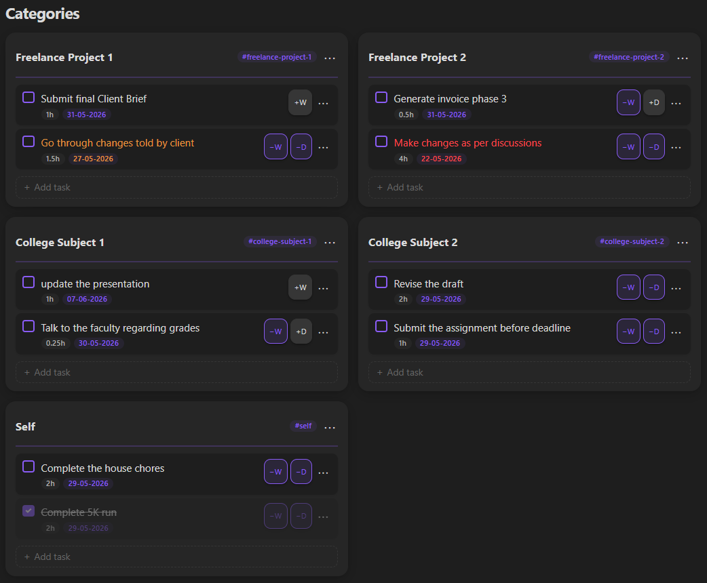
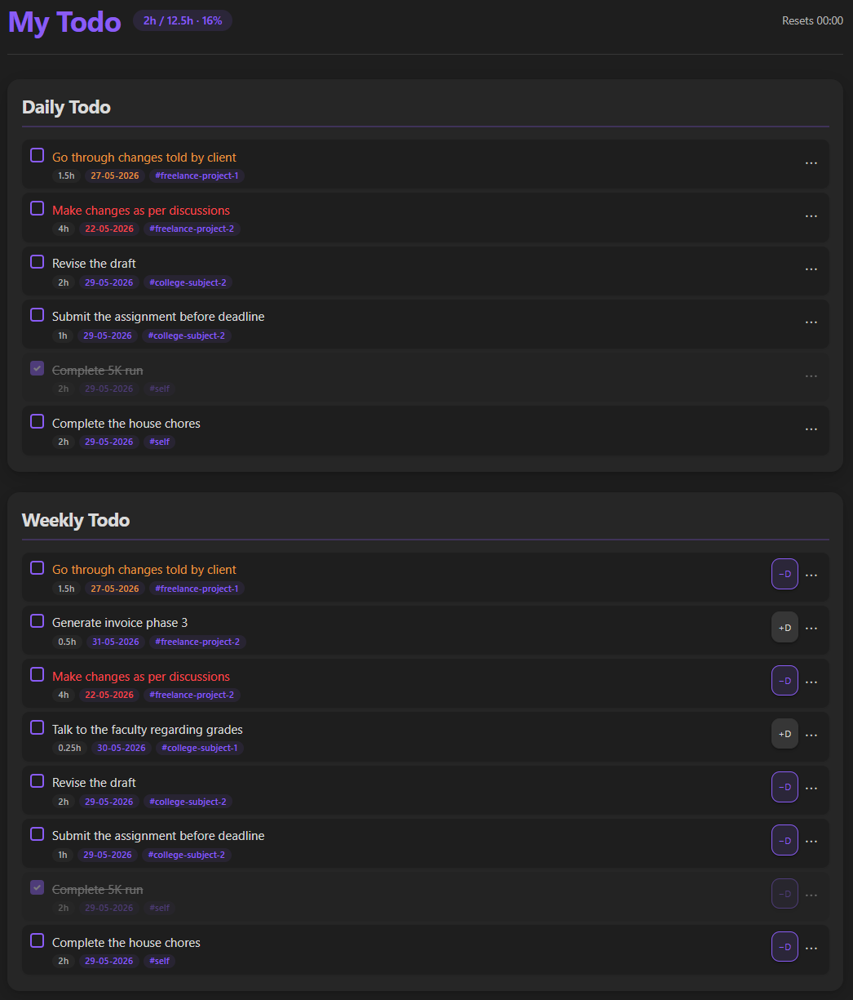
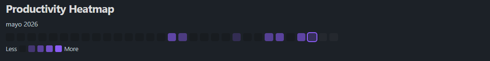

# My Todo

  
<strong>Defeat task overwhelm. Streamline your focus from categories to daily action, natively in Obsidian.</strong>

  

    
    
    
    
  

---

## 🎯 The Core Pitch

Most task managers suffer from the **backlog trap**: you capture everything, your lists grow indefinitely, and daily planning becomes a source of anxiety rather than action. 

**My Todo** is a minimalist, high-velocity task pipeline designed specifically for Obsidian. It bridges the gap between high-level organization and immediate, frictionless focus. By introducing a structured **Category → Weekly → Daily** planning loop, My Todo ensures that your long-term goals are effortlessly channeled into today's execution queue—without the clutter.

> [!TIP]
> **Built for developers, thinkers, and builders.** My Todo stays out of your way, operating with speed, clean hotkeys, and native Obsidian feel.

---

## 📸 Visual Demos

### Category Board
Organize your universe by custom tags. See your backlogs at a glance without feeling overwhelmed.

### Weekly & Daily Planner
Frictionlessly promote tasks from your high-level categories into weekly priorities and daily commitments.

### Productivity Heatmap
Visualize your daily momentum over time. A subtle, satisfying way to build and maintain consistency.

---

## ✨ Key Features

### 🗂️ Organized Category Board
* **Custom Tag Associations:** Bind specific Obsidian tags directly to dedicated category columns.
* **Instant Ingestion:** Any task tagged in your vault is automatically captured, structured, and presented in the Kanban-style Category Board.
* **Frictionless Sorting:** Keep your ideas, projects, and chores logically partitioned.

### 🔄 The Frictionless Planning Loop
* **Promote in One Click:** Drag, drop, or use rapid shortcuts to escalate tasks from raw Categories into your **Weekly Plan**, and then into **Daily Focus**.
* **Zero Overhead:** No manual copy-pasting or file editing required. Move tasks across planning horizons instantly.
* **Intelligent Rollover:** Automatically rolls over incomplete tasks or clears completed items at a custom daily threshold time of your choosing.

### ⚡ Live Sync & Hot-Reload
* **Event-Driven Listeners:** Instant, real-time UI updates when task lists are modified by external tooling (such as the **Gemini CLI**).
* **Bi-directional Integrity:** Always trust your todo view. External edits reflect instantly in the Obsidian UI without requiring a reload or manual file refresh.

### 🧭 Smart Navigation & Deep-Linking
* **Double-Click to Trace:** Double-click any task in your Weekly or Daily Planner to smoothly scroll down and flash-highlight its parent category.
* **Context Preservation:** Never lose track of *why* a task exists. Jump from immediate action items directly to their high-level categorical context in milliseconds.

### 🎨 Theme-Adaptive UI
* **Obsidian-Native Swatches:** Fully integrates with the active Obsidian accent color theme.
* **Seamless Dark & Light Modes:** Clean typography, custom borders, and beautiful, minimalist components that feel like an official core feature, not a third-party add-on.

---

## 🚀 Installation

**My Todo** is officially live on the Obsidian Community Plugins directory!

### Option 1: Direct Install (Recommended)
1. Open **Obsidian Settings** in your vault.
2. Navigate to **Community Plugins** and click **Browse**.
3. Search for **My Todo**.
4. Click **Install**, then click **Enable**.

### Option 2: Manual Installation (For Beta/Custom Builds)
If you wish to run a pre-release or custom build:
1. Download the latest release asset bundle (`main.js`, `manifest.json`, `styles.css`) from the [Releases](https://github.com/amanxarora/my-todo/releases) page.
2. Create a folder in your vault at `.obsidian/plugins/my-todo`.
3. Move the downloaded files into that folder.
4. Open Obsidian, go to **Settings > Community Plugins**, and toggle **My Todo** on.

---

## 🛠️ Workflows & CLI Integration

My Todo is built with open architectures in mind. Because tasks are saved in structured, clean markdown files, you can seamlessly read and write to your planning queues using external CLI utilities.

> [!NOTE]
> If you utilize custom automation (e.g. sync scripts, terminal task injectors, or AI co-pilots like **Gemini CLI**), the **Live Sync Hot-Reload** feature ensures that your Obsidian pane refreshes instantly the moment a disk-level change is detected.

---

## 💬 Support & Feedback

This is an active open-source project! If you encounter any bugs, have feature requests, or want to share how you're using My Todo to streamline your life:
* 🐛 [Open an Issue on GitHub](https://github.com/amanxarora/my-todo/issues)
* 🌟 Star the repository to show your support!

---

## 🔗 Connect with Me

I'm **Aman Arora**, a developer building tools to help people focus and create. If you like this plugin, let's connect!

  
  
  
  
  

---

## 📄 License

This project is licensed under the [MIT License](LICENSE).
